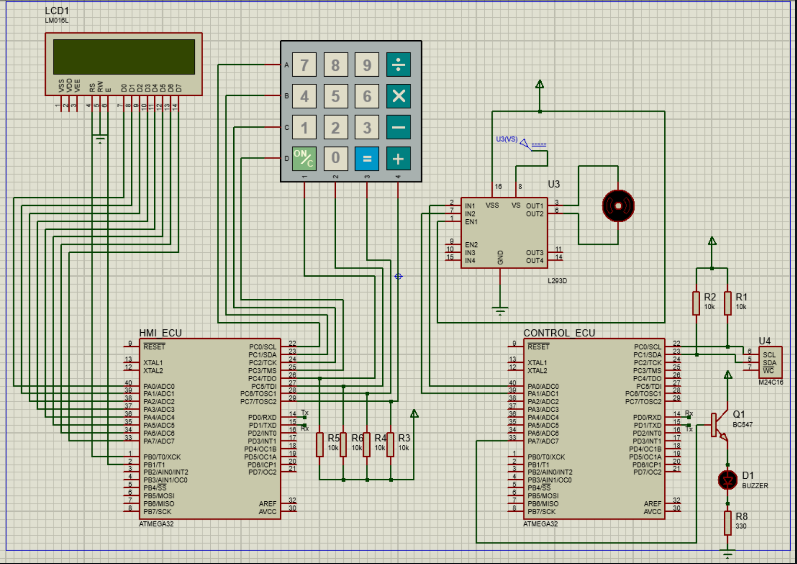

# Door-locker-System
## Overview

This project demonstrates a secure door locking mechanism utilizing password authentication, powered by two ATmega32 Microcontrollers. The system follows a structured, layered architecture and is composed of two main units:

- HMI_ECU (Human Machine Interface): Provides user interaction via a 2x16 LCD display and a 4x4 keypad.

- Control_ECU: Executes the core functionalities, including password verification, door operation, and alarm activation.

## System Functionality

- Step 1: Setting Up the Password

The system requests a 5-digit password from the user through the HMI_ECU.

Users confirm the password by re-entering it.

If both entries match, the password is saved in the EEPROM, allowing the user to proceed. Otherwise, the process is repeated.

- Step 2: Displaying Main Options

The LCD continuously shows the main menu, listing available actions.

- Step 3: Door Operation

To unlock the door, users must enter the saved password.

If the password is correct:

The door unlocks, rotates clockwise for 15 seconds, pauses for 3 seconds, and then locks again by rotating counterclockwise for 15 seconds.

If the password is incorrect, the system prompts the user to re-enter it.

- Step 4: Password Modification

Users can update their password by:

Providing the current password for verification.

Entering and confirming a new password.

- Step 5: Handling Errors

After three failed password attempts:

An alarm buzzer sounds for 1 minute.

An error message is displayed on the LCD.

The system locks temporarily, disabling further input until the alarm duration ends.

## Drivers Utilized in the System

- GPIO Driver

Manages the microcontroller's General Purpose Input/Output (GPIO) pins.

- LCD Driver

Operates the 2x16 LCD to display messages and system status.

- Keypad Driver

Captures input from the 4x4 keypad for password and menu navigation.

- DC Motor Driver

Controls the motor responsible for the door’s locking and unlocking movements.

- EEPROM Driver

Facilitates interaction with the external Electrically Erasable Programmable Read-Only Memory (EEPROM) for secure password storage.

- I2C Driver

Enables communication via the Inter-Integrated Circuit (I2C) protocol.

- UART Driver

Handles serial communication using the Universal Asynchronous Receiver-Transmitter (UART) protocol.

- Timer Driver

Provides accurate timing for tasks such as motor operation and alarm duration.

- Buzzer Driver

Activates the buzzer for audible notifications during alarms or errors.

## Key Advantages

- Robust Security: Protects against unauthorized access.

- Error Resilience: Effective measures to manage incorrect password entries.

- Ease of Use: Simple and intuitive LCD and keypad interface.

- Dependable Performance: Precision timing and reliable motor control ensure seamless operation.
